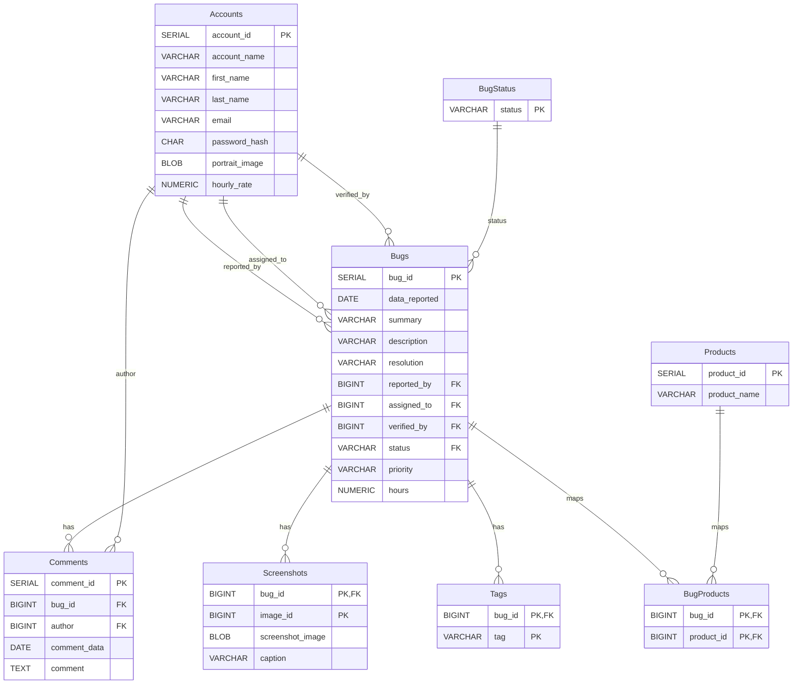

# SQLアンチパターン 第2版

[SQLアンチパターン 第2版](https://www.oreilly.co.jp/books/9784814400744/)
ISBN: 978-4-8144-0074-4

- [追加情報](https://pragprog.com/titles/bksap1/sql-antipatterns-volume-1/)

## テスト環境

<!-- cspell:ignore -proot -->
```sh
colima start
docker-compose up -d
docker-compose exec mysql mysql -u root -proot practice
docker-compose down
# docker-compose down -v
colima stop
```

```sh
docker-compose exec -T mysql mysql -u root -proot practice < 1-3.sql
```

```sh
source /sql/1-3.sql;
```

### 環境設定

| 項目 | 値 |
| ------ | ----- |
| ホスト | `localhost:3306` |
| ユーザー | `root` |
| パスワード | `root` |
| データベース | `practice` |

### ER図


